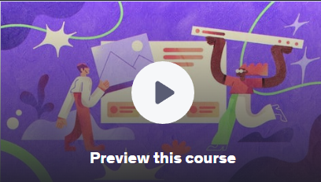
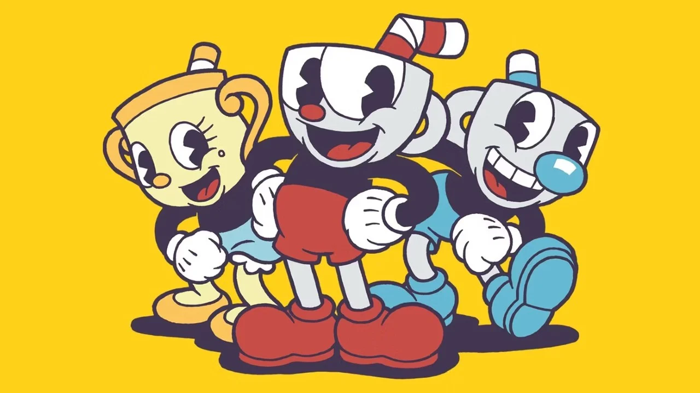
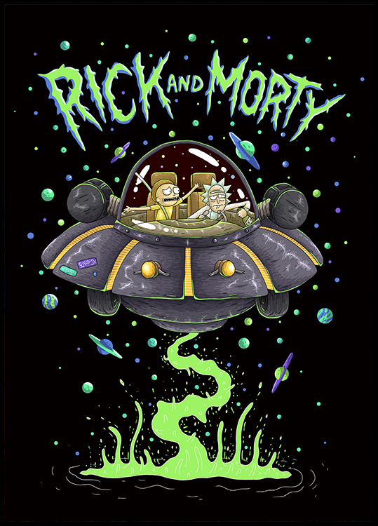

# Web Programming Assignments

A collection of various projects and assignments developed for a web programming course. This repository showcases different web technologies and concepts, from basic HTML/CSS to full-stack applications.

## Projects

Here is a summary of the projects included in this repository.

---

### 1. Assignment 2: CSS Animations

This project includes two simple web pages demonstrating CSS effects.

*   **Cube**: A 3D cube created and animated using pure CSS.
*   **Fade**: A demonstration of fade-in/fade-out transitions.

**Technologies:** HTML, CSS

---

### 2. Assignment 3: Course Preview Page

A static web page designed to look like a Udemy course preview page.

**Technologies:** HTML, CSS

---

### 3. Assignment 4: Cuphead Fan Page

A dynamic web page dedicated to the game *Cuphead*. It likely uses JavaScript to manage content and interactions. The project is rich with images and icons from the game.

**Technologies:** HTML, CSS, JavaScript

---

### 4. Assignment 5: TV Show Browser

A dynamic web page that seems to display a collection of TV shows, possibly with interactive elements managed by JavaScript.

**Technologies:** HTML, CSS, JavaScript

---

### 5. Assignment 6: E-commerce Website

A full-stack e-commerce web application.

*   **Backend**: A PHP-based API handles business logic, including products, categories, and a shopping cart. It connects to a MySQL database.
*   **Frontend**: A modern single-page application (SPA) built with Angular, which communicates with the PHP backend.

**Technologies:** Angular, TypeScript, PHP, MySQL, HTML/CSS

---

### 6. DOOM Website

A static website celebrating the classic game *DOOM*, featuring embedded videos and audio.

**Technologies:** HTML, CSS

---

### 7. Snake Game

A classic Snake game implemented in Java, likely as a desktop application using a framework like Swing or JavaFX.

**Technologies:** Java, Maven
